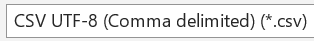

```{r setup, include=FALSE, echo=FALSE}
options(htmltools.dir.version = FALSE)
knitr::opts_chunk$set(
  fig.retina=2,
  #out.width = "75%",
  #out.height = "50%",
  htmltools.preserve.raw = FALSE,      # needed for windows
  scipen=100,                          # suppresses scientific notation
  getSymbols.warning4.0 = FALSE,       # suppresses getSymbols warnings
  cache = FALSE,
  echo = TRUE,
  hiline = TRUE,
  message = FALSE, 
  warning = FALSE
)


# install helper package (pacman)
# pacman loads and installs other packages, if needed
if (!require("pacman")) install.packages("pacman", repos = "http://lib.stat.cmu.edu/R/CRAN/")

# install and load required packages
# pacman should be first package in parentheses and then list others
pacman::p_load(pacman, tidyverse, gridExtra, magrittr, lubridate, 
               knitr, kableExtra)

# verify packages (comment out in finished documents)
p_loaded()


```

```{r xaringan-themer, include=FALSE, warning=FALSE}
library(xaringanthemer)

palette <- c(
  SU_Orange1        = "#F76900",
  SU_Orange2        = "#FF8E00",
  SU_Red_Orange     = "#FF431B",
  SU_Blue1          = "#000E54",
  SU_Blue2          = "#203299",
  SU_Light_Blue     = "#2B72D7",
  SU_White          = "#FFFFFF",
  SU_Light_Gray     = "#ADB3B8",
  SU_Medium_Gray    = "#707780",
  SU_Black          = "#000000", 
  
  steel_blue        = "#4682B4",
  corn_flower_blue  = "#6495ED",
  deep_sky_blue     = "#00BFFF",
  dark_magenta      = "#8B008B",
  medium_orchid     = "#BA55D3",
  lime_green        = "#32CD32",
  light_sea_green   = "#20B2AA",
  chartreuse        = "#7FFF00",
  orange_red        = "#FF4500",
  white_smoke       = "#F5F5F5",
  dark_cyan         = "#008B8B",
  light_steel_blue  = "#B0C4DE",
  indigo            = "#4B0082",
  ivory             = "#FFFFF0",
  light_slate_grey  = "#778899",
  linen             = "#FAF0E6",
  steel_blue        = "#4682B4",
  blue_violet       = "#8A2BE2",
  dodger_blue       = "#1E90FF",
  light_blue        = "#ADD8E6",
  azure             = "#F0FFFF",
  lavender          = "#E6E6FA")

primary_color = "#4682B4"                # steel_blue
secondary_color = "#778899"              # light_slate_grey
white_color = "#FFFFF0"                  # ivory
black_color = "#000080"                  # navy

style_duo_accent(
  primary_color = primary_color,
  secondary_color = secondary_color,
  white_color = white_color,
  black_color = black_color,
  text_color = black_color,
  header_color = primary_color,
  background_color = white_color,
  code_inline_background_color = "#E6E6FA", # lavender
  link_color = "#1E90FF",                   # dodger_blue
  code_inline_color = "#4B0082",            # indigo
  text_bold_color = "#8B008B",              # dark_magenta
  header_font_google = google_font("Open Sans"),
  text_font_google = google_font("Open Sans"),
  code_font_google = google_font("Source Code Pro"),
  colors = palette
)


```

```{r xaringan-panelset, echo=FALSE}
xaringanExtra::use_panelset()
```

```{r xaringan-tile-view, echo=FALSE}
xaringanExtra::use_tile_view()
```

```{r xaringan-fit-screen, echo=FALSE}
xaringanExtra::use_fit_screen()
```

```{r xaringan-tachyons, echo=FALSE}
xaringanExtra::use_tachyons()
```

```{r xaringan-animate-css, echo=FALSE}
xaringanExtra::use_animate_css()
```

```{r xaringan-animate-all, echo=FALSE}
#xaringanExtra::use_animate_all("slide_up")
```

background-image: url("docs_files/images/sloth_faded.png")
background-size: cover

class: bottom, right

## BUA 455 - Week 5 - Lecture 10

### Intro to Importing and Cleaning Data  

<br>


#### Penelope Pooler Eisenbies

#### `r Sys.Date()`

[Wikipedia Sloth Page](https://en.wikipedia.org/wiki/Sloth)

---

### Comments About Quiz 1

---

### Importing and Cleaning Messy Data

- So Far we have worked with R datasets 

  - These datasets are already in a useable format
  
  - Sometimes they need to be modified, e.g., reshaped, filtered, etc.
  
- We have also imported **cleaned** data

- Now we will work through the process of cleaning data

- The goal of this portion of the course:

  - Learn to clean data found on the internet to make it usable for plotting, display or analyses.
  
---

### Importing Messy Data

- **Best Practice:** Save dataset as save them as .csv files (UTF-8 format):

  
  
- **DO NOT** edit data in Excel.  

  - Editing choices in Excel are not documented
  
  - It is easy to make errors that corrupt the data
  
  - Anything you do this file will have to be repeated whenever you update the data.
  
---
  
### Questions to Answer **BEFORE** Importing DATA

- Are there rows at the top that need to be removed. 
  - If so, how many?

- Are there non-data rows in the data?  
  - If so, determine which variable(s) have no data for those rows.

- Are there rows at the bottom that need to be removed?
  - If so, how many? 
  - Can they be removed with the non-data rows?

- Do you know what each variable is? 
  - If not, find out, before importing the data.  
  - It may be helpful to create an informal data dictionary a separate Excel file. 

- Do the data need to be reshaped so that each column is a single variable?

---

***TurningPoint Session ID: bua455s22***

### Week 5 In-class Exercises (TP L10 - Q1)

Examine the `box_office_mojo_2021.csv` file to determine how many rows will need to be removed at the top.

This number will used for the `skip` option in the `read_csv` import command.

How many rows should be skipped?

<br>

### Week 5 In-class Exercises (TP L10 - Q2)

Examine the columns in the `.csv` file and widen them if needed to determine the first variable that is blank for non-data rows.  This variable will be used to filter out the non-data rows that indicate holidays or covid status.

What is the first variable that can be used to filter out non-data rows?

---

.panelset[

.panel[.panel-name[**Import the Data**]

`skip=10` deletes all of the non-data rows above the variable names

```{r import messy bom data}
bom21 <- read_csv("box_office_mojo_2021.csv", skip=10, show_col_types = FALSE) |>
  glimpse()
```

]

.panel[.panel-name[**Filter out non-data rows**]

```{r filter out bom non-data rows}
bom21 <- bom21 |>
  filter(!is.na(Day)) |> # filters out rows that have no data for Day
  glimpse()
```

]

.panel[.panel-name[**Rename and Select Variables**]

Messy variable names with symbols can cause issues, even if code is correct
One Solution is to select and reorder variables by column number and then rename using `names` command.
This solution requires care in naming variables correctly

```{r rename and select vars bom21}
bom21 <- bom21 |>
  select(1,4:9) # selects columns 1 and 4-9

names(bom21) <- c("date","top10gross", "pct_ch_day", "pct_ch_wk", 
                  "num_releases", "num1", "num1gross") # renames columns but requires care
bom21 <- bom21 |>
  select(date, top10gross, num1gross, num_releases, num1, pct_ch_day, pct_ch_wk) # reorder vars
head(bom21)

```

]

]

---

### Cleaning Data and Converting (Coercing) Variable Types

Examine each variable of the imported data

Questions to Answer:

- Is each variable type correct?
  e.g. numeric (*`<dbl>`*), character (*`<chr>`*), date(*`<date>`*), factor(*`<fct>`*)
  
- If there are numeric variables that are classified as character, are their nuisance characters to remove?
  e.g. `$`, `,`, `%`, etc.
  
- Are the date variables classified as character variables?
  - If so, are they in a format that can be converted?
    - Minimum required is year and month
    - Day (of month) can be i ncluded if provided

- Do numeric variables need to be changed to integers or rounded for plots or tables

- Are text variables useful are should they be set aside?
  - At minimum, we can examine the text variables for later use

---

### One way to Clean and Convert Variables to Numeric

- In R, there are MANY ways to do each task

- In this course, I show you one (or two) reliable ways to complete essential data management tasks.

  - `gsub` can be used to remove nuisance characters

  - AFTER removing nuisance characters,
  
    - `as.numeric` can be used to convert a character variable to numeric. 
    
```{r examine bom21 data using head}
head(bom21)
```

---

### Using `gsub` and `as.numeric` on ONE variable

- `gsub` and `as.numeric` are used WITHIN `mutate`
- Nusiance characters are specified in quotes
- `as.numeric` is used at end of last `gsub` command.
- Notice below that TWO consecutive `gsub` commands are used in same `mutate` command separated by a comma

```{r converting top10gross to numeric in bom21}
bom21 <- bom21 |>
  mutate(top10gross = gsub("$","", top10gross, fixed = T),
         top10gross = gsub(",","", top10gross, fixed = T) |> as.numeric()) |>
  glimpse()
```

---

### Using `gsub` and `as.numeric` on MULTIPLE variables

Same as previous slide, but all numeric variables are included in one mutate statement.

```{r converting ALL numeric variables to numeric}
bom21 <- bom21 |>
  mutate(top10gross = gsub("$","", top10gross, fixed = T),  # convert top10gross (2 lines)
         top10gross = gsub(",","", top10gross, fixed = T) |> as.numeric(),
         
         num1gross = gsub("$","", num1gross, fixed = T),   # convert num1gross (2 lines)
         num1gross = gsub(",","", num1gross, fixed = T) |> as.numeric()) |>
  glimpse()
```

---

### Week 5 Blackboard In-class Exercise 1

**Using the mutate command above as an example, Create a new `mutate` command to:**

- Remove `%` from each of the the `pct_ch` variables and convert them to numeric values.
  
  - In this case, only one `gsub` statement is needed for each variable.
  - We are only removing 1 character, `%`.

<br>
  
- When you are done, `glimpse` the data with the corrected percent variables.
  
- Submit the output from `glimpse` in the Blackboard Week 5 In-Class Assignment by copying and pasting this output showing these two percent variables have been converted to decimal (*`<dbl>`*) values.

---

### Solution to BB In-class Exercise 1

```{r solution to pct change conversion}

bom21 <- bom21 |>
  mutate(pct_ch_wk = gsub("%","", pct_ch_wk, fixed = T) |> as.numeric(),  
         pct_ch_day = gsub("%","", pct_ch_day, fixed = T) |> as.numeric()) |>
  glimpse()

```

---

### Converting Numeric to Integers and Creating Rounded Variables

- Converting a decimal value to an integer is straightforward with the `as.numeric` command.

- If the variable is discrete, e.g., number of releases (`num_releases`), then overwrite the orginal variable

- In contrast, `top10gross` and `num1gross` are correctly formatted, but we may need rounded versions.
  - Dividing these variables by one million makes sense for plots and table presentations
  - In this case we will create NEW variables.
  
```{r formatting numeric variables in bom21}
bom21 <- bom21 |>
  mutate(num_releases = as.integer(num_releases),         # num_releases is overwritten
         top10grossM = (top10gross/1000000) |> round(2),  # top10grossM is a created variable
         num1grossM = (num1gross/1000000) |> round(2))    # num1grossM is a created variable
head(bom21)
```

---

### Converting Date text to a Date Variable with `lubridate`

.panelset[

.panel[.panel-name[**Intro to `lubridate`**]

- The `lubridate` package makes dealing with date variables VERY straightforward

- All that is needed is a **year, month (text or numeric), and a day of month**.

- Values can be in any order with any separator

- At present, the `date` variable in our dataset includes day of month and month, e.g. "31-Dec"

  - We will add a year value to this text variable with a `paste` command, e.g. "31-Dec-2021"

  - NOTE that the order of the information is Day, Month, Year
 
  - That order means we will use the `dmy` command to convert the text to a date.

- Afterwards, we can create any other data and time variables needed from this date variable.
  - e.g. day of week, day of year, quarter, month, etc.

]

.panel[.panel-name[**Adding year to date text**]

-`paste` is one way to combine strings of text
- Below I show how to specify the separator (`sep`)
- `paste` is also one way to join the text from two or more columns

```{r add year to date in bom21}

bom21 <- bom21 |>
  mutate(date = paste(date,"2021", sep="-"))
head(bom21)
```
]

.panel[.panel-name[**Convert to a Date variable**]

- `date` in the dataset `bom21` is a character variable
- The information is in the order day-month-year, so we use the command `dmy`
- We overwrite the current variable because the text version is not useful
- NOTE: `paste` and `dmy` could be done in one command : `dmy(paste(date, "2021"))`
- `sep` was not required but was shown as an example

```{r create date var from date text}
bom21 <- bom21 |>
  mutate(date = dmy(date)) 
head(bom21)

```

]

.panel[.panel-name[**Create Other Date Variables**]

- `lubridate` allows you to also create other variables from your `date` variable
- The [lubridate Cheat Sheet](https://rawgit.com/rstudio/cheatsheets/main/lubridate.pdf) is a great reference.
- Below I demonstrate how to create month and day of week variables in abbreviated (`abbr`) text format.

```{r create month and day of week variables from date in bom21}
bom21 <- bom21 |>
  mutate(month = month(date, label=T, abbr=T),
         day = wday(date, label=T, abbr=T)) |>
  glimpse()

```


]
  
]

---

### Week 5 Blackboard In-class Exercise 2

**Add to the mutate statement above to to create the variable `quart` (quarter).**

- Use command `quarter` from `lubridate` package

- Examine command in help window using `?quarter` 

- Check [cheat sheet](https://rawgit.com/rstudio/cheatsheets/main/lubridate.pdf)
  
  - NOTE: There is no `label` or `abbr` option for the `quarter` command.

<br>

Submit the output from `glimpse` in the Blackboard Week 5 In-Class Assignment by copying and pasting this output showing `day`, `month`, and `quarter` have been added to the data.

---

### Solution to BB In-class Exercise 1

```{r solution for creating bom21 quarter var}
bom21 <- bom21 |> 
  mutate(quart = quarter(date)) |> # returns numeric value for quarter
  glimpse()                        # text labels can be created later with ifelse

```


---

### Plotting Data using Date Variable (Time Series Plot)

.panelset[

.panel[.panel-name[**Why Plot a Time Series?`**]

- Date is treated as numeric and specified as the x-axis.

  - Date can be used for filtered to limit time series

- Plotting percent change over time shows some surprising results

  - I am puzzled how BOM calculates these values.
  
- If I were using these data for consulting I would:
  
  - Reach out to BOM for clarification
    
  - Calculate a percent change variable myself using `lag`
  
- It is often useful to plot data which allows you to see quirks that would otherwise not be noticeable.

]

.panel[.panel-name[**R Code to Create Plot**]

```{r select reshape and plot time series}
bom21_pct <- bom21 |>
  select(date, pct_ch_day, pct_ch_wk) |>
  rename(Daily=pct_ch_day, Weekly=pct_ch_wk) |>
  pivot_longer(cols=Daily:Weekly,                 # data reshaped using pivot_longer
               names_to = "type_pct_ch",
               values_to = "pct") |>
glimpse()

pct_ch_lineplot <- bom21_pct |>
  ggplot() +
  geom_line(aes(x=date, y=pct, color=type_pct_ch)) +
  theme_classic() +
  labs(x="Date", y="Percent Change", color="") + # plot is minimally formatted
  lims(y=c(-100, 2000))                          # labels and y axis limits are specified
```

]

.panel[.panel-name[**Box Office Pct. Change Plot**]

```{r bom21 pct change time series plot, fig.dim=c(15,6.5), echo=F}
pct_ch_lineplot
```

]


]

---

### Save (Export) Clean Dataset

- You can create other variables, but this is now a clean (tidy) dataset.

  - In future weeks we will talk more about creating factor variables.

- A good practice is to save your clean dataset by exporting it as a .csv file

- First we will use select to reorder the variables

  - Group time variables followed by the rest
  
  - `:` can be used to list the rest of the variables

```{r reorder variables and export clean data, eval=F}

# reorder variables
bom21 <- bom21 |>
  select(date, quart, month, day, top10gross, top10grossM, num1gross, num1grossM,
         num_releases:pct_ch_wk) 

# export clean data
bom21 |> write_csv("box_office_mojo_2021_tidy.csv")

```

---

### Preview of Next week

- Repeating these steps for Box office 2020 data

- Examining/Cleaning Bureau of Labor Statistics data

- Writing functions to automate process

- Joining data from multiple datasets

- Intro to time series (xts) data

- HW 4 will be assigned

---

background-image: url("docs_files/images/tired_panda_faded.png")
background-size: cover

.pull-left[

### **Key Points from Week 5**

.bg-azure.b--dark_cyan.ba.bw2.br3.shadow-5.ph2[

**Review Quiz 1**

- Come see me or a TA with Questions

- At least one question from Quiz 1 will be on Quiz 2

- Other questions on Quiz 2 will build on Quiz 1

**Cleaning Messy Data**

- There are always may ways to accomplish each goal

- Each messy dataset has unique challenges

- Mastering and combining these core skills will allow you to clean any dataset

**Plotting Data**

- It is often helpful to select variables and reshape data for a plot

]

]

.pull-right[

.bg-azure.b--dark_cyan.ba.bw2.br3.shadow-5.ph3[
**You may submit an 'Engagement Question or Comment' about Week 5 (Lecture 10) until Thursday, 9/22, at midnight on Blackboard.**
]

]
